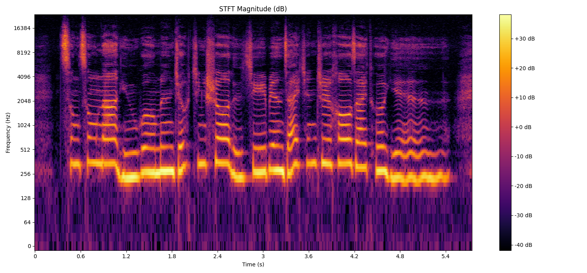
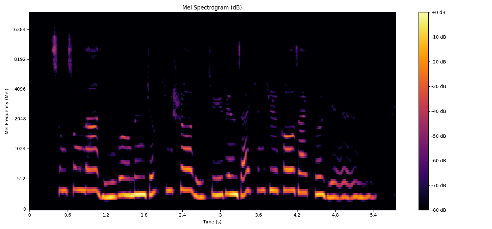
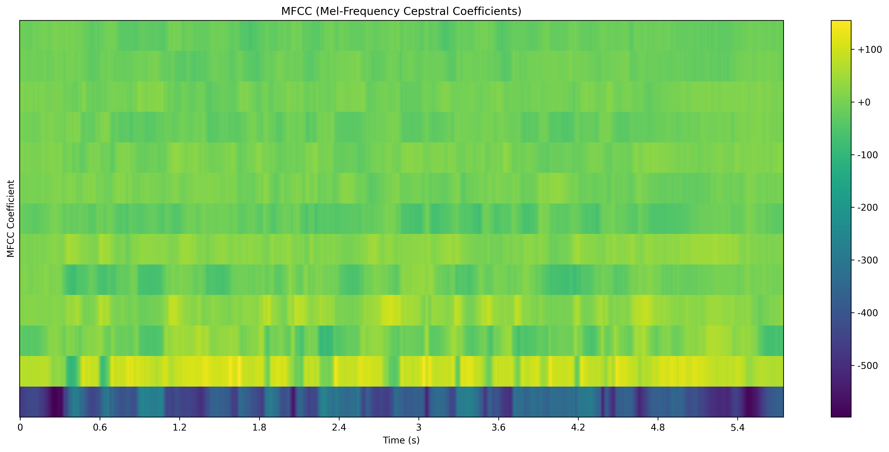

# 音频特征提取与可视化

输入音频：

0000.wav

5.745 s

48000k

## STFT与线性谱

### 计算原理

分帧，加窗，FT

### 维度变化

sr is 48000

shape of wav is (275760,)

输入数据维度: (275760,)

输出频谱维度: (1025, 539)

## 梅尔频谱

### 计算原理

通过梅尔标度滤波器组

更符合人耳听觉，低频分辨率更高

### 维度变化
Input data dimensions: (275760,)

Output:

梅尔频谱矩阵：二维数组 (n_mels, n_frames)

其中 n_mels 为梅尔滤波器数量

Output Mel spectrogram dimensions: (128, 539)

## MFCC

MFCC ≈ “从 Mel 频谱中提取出与发音内容最相关的稳定特征”

MFCC 的目的是：去除冗余、压缩表示、增强鲁棒性，更适合传统语音识别模型。

把“人耳听觉特性”塞进特征里：低频敏感、高频迟钝 → 用 Mel 刻度 重新标定频率轴

### 计算原理

再对数 + DCT（离散余弦变化） → 得到 倒谱系数（Cepstral），即 MFCC

| 系数          | 昵称   | 物理含义             | 直观例子                    |
| ------------- | ------ | -------------------- | --------------------------- |
| **MFCC-0**    | 能量轴 | 整帧能量（log-sum）  | 大声/小声                   |
| **MFCC-1**    | 重心轴 | 频谱“重心”高低       | 男声低、童声高              |
| **MFCC-2**    | 斜率轴 | 低频 vs 高频能量斜率 | 鼓声（负斜）、鸟鸣（正斜）  |
| **MFCC-3~6**  | 形状轴 | 共振峰精细结构       | 元音 a/o/i 的“包络凹凸”     |
| **MFCC-7~12** | 纹理轴 | 高阶微小区别         | 嘶/沙、鼻音、齿音等音色细节 |

### 输出维度

Input data dimensions: (275760,)
Output MFCC dimensions: (13, 539)

